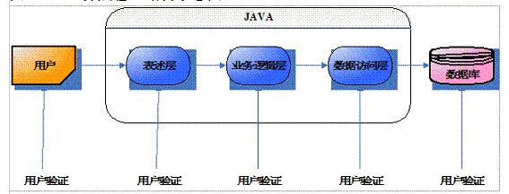

#  Beautiful REST API

应用程序和 API 之间的交互中实际上只有3个结果：
  1. 一切正常
  2. API 错误
  3. 应用程序错误

当一切正常的情况下，API 响应只需要返回资源本身信息即可。当应用程序出错或 API 出错时我们需要将出现错误的问题信息返回给客户端，告知客户端发生了什么，并且该如何解决。

对应了下面三种数据响应格式

REST API 正常响应数据格式：

```http
HTTP/1.1 200 OK
Content-Type: application/problem+json
Content-Language: en

{
    "id": 778671998,
    "name": "mecode",
    "email": "778671998@qq.com"
}
```

API 错误（客户端导致,例如：客户端传递了无效的参数。）

```http
HTTP/1.1 400 BadRequest
Content-Type: application/problem+json
Content-Language: en

{
    "id": 778671998,
    "name": "mecode",
    "email": "778671998@qq.com"
}
```

应用程序错误（服务端导致，例如：应用程序内存溢出。）

```http
HTTP/1.1 400 BadRequest
Content-Type: application/problem+json
Content-Language: en

{
    "id": 778671998,
    "name": "mecode",
    "email": "778671998@qq.com"
}
```

## 目标

* GOAL#1 解决应用各层参数校验重复繁琐问题
  * [x] GOAL#1.1 表述层（表现层、Controller 层）
  * [ ] GOAL#1.2 业务逻辑层（服务层）
  * [ ] GOAL#1.3 数据访问层 (仓储层)
  



* GOAL#2 在表述层统一处理异常，优化异常捕获策略（减少 try...catch 代码，改为自动抛出异常）。
    > 全局处理当然不会只能处理一种异常，用途也不仅仅是对一个参数校验方式进行优化。在实际开发中，如何对异常处理其实是一个很麻烦的事情。传统处理异常一般有以下烦恼：
    > 1. 是捕获异常(try...catch)还是抛出异常(throws)
    >  2. 是在 controller 层做处理还是在 service 层处理又或是在 dao 层做处理(在哪里处理)
    > 3. 处理异常的方式是啥也不做，还是返回特定数据，如果返回又返回什么数据（处理方式）
    > 4. 不是所有异常我们都能预先进行捕捉，如果发生了没有捕捉到的异常该怎么办？（如何处理未知异常）

    * [x] GOAL#2.1 支持 `@Valid` Exception
    * [x] GOAL#2.2 支持 Spring MVC Exceptions
    * [ ] GOAL#2.3 支持 Spring Security Exceptions

    

    标准的 Spring MVC Exceptions

| Exception                                 | HTTP Status Code             |
| ----------------------------------------- | ---------------------------- |
| `BindException`                           | 400 (Bad Request)            |
| `ConversionNotSupportedException`         | 500 (Internal Server Error)  |
| `HttpMediaTypeNotAcceptableException`     | 406 (Not Acceptable)         |
| `HttpMediaTypeNotSupportedException`      | 415 (Unsupported Media Type) |
| `HttpMessageNotReadableException`         | 400 (Bad Request)            |
| `HttpMessageNotWritableException`         | 500 (Internal Server Error)  |
| `HttpRequestMethodNotSupportedException`  | 405 (Method Not Allowed)     |
| `MethodArgumentNotValidException`         | 400 (Bad Request)            |
| `MissingServletRequestParameterException` | 400 (Bad Request)            |
| `MissingServletRequestPartException`      | 400 (Bad Request)            |
| `NoSuchRequestHandlingMethodException`    | 404 (Not Found)              |
| `TypeMismatchException`                   | 400 (Bad Request)            |

* GOAL#3 通过自定义异常增加全局异常处理灵活性(自定义异常能携带更多的错误信息，而传统异常只能传递一个字符串)，并且自定义异常语义更明确，能更好的标识错误。
* GOAL#4 通过实现 RFC7807 规范（`Problem Detail`）统一 REST API 问题信息格式。
* GOAL#5 在表述层统一处理数据响应格式，减少使用 `Problem` 包装类的机会。
* GOAL#6 使 REST API 符合[理查森成熟度模型](https://martinfowler.com/articles/richardsonMaturityModel.html) 第二等级要求
    * [ ] GOAL#6.1 HTTP Status Code


## 问题

`@ExceptionHandler` 的工作机制

## 信息参考

* [SpringBoot三招组合拳，手把手教你打出优雅的后端接口](https://mp.weixin.qq.com/s/waPatEnrFnStcfa9Z1RZsQ)
* [概述 Bean Validation 规范](https://developer.ibm.com/zh/articles/j-lo-beanvalid/)
* [Custom Error Message Handling for REST API](https://www.baeldung.com/global-error-handler-in-a-spring-rest-api)
* [Error Handling for REST with Spring](https://www.baeldung.com/exception-handling-for-rest-with-spring)
* [Handling Standard Spring MVC Exceptions](https://docs.spring.io/spring-framework/docs/3.2.x/spring-framework-reference/html/mvc.html#mvc-ann-rest-spring-mvc-exceptions)
* [Exception Handling in Spring MVC](https://spring.io/blog/2013/11/01/exception-handling-in-spring-mvc)

## 规范引用

* [JSR303](https://beanvalidation.org/1.0/spec/)